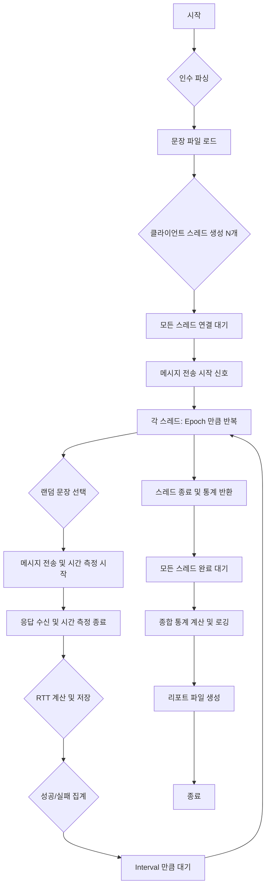
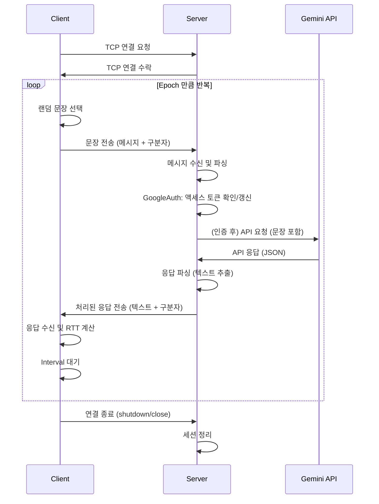

# TCP 클라이언트/서버 및 Gemini API 연동 프로젝트

## Disclaimer

**주의:** 이 코드는 Google Gemini API 연동 및 TCP 클라이언트/서버 통신 테스트를 위한 **데모 및 테스트 목적**으로 생성되었습니다. 실제 운영 환경에서의 사용을 가정하지 않았으며, 다음과 같은 사항에 유의하시기 바랍니다:

*   **보안:** 실제 운영 환경 수준의 보안 조치(입력값 검증, 오류 처리, 접근 제어 등)가 충분히 구현되어 있지 않을 수 있습니다.
*   **안정성 및 성능:** 특정 테스트 시나리오 외의 다양한 환경에서의 안정성이나 최적의 성능을 보장하지 않습니다. 부하 테스트 결과는 특정 환경에 따라 달라질 수 있습니다.
*   **오류 처리:** 모든 예외 상황에 대한 완벽한 오류 처리가 구현되어 있지 않을 수 있습니다.
*   **API 키 관리:** 예제 코드에 포함된 서비스 계정 키(`service-account-key.json`)는 데모용이며, 실제 환경에서는 안전하게 관리되어야 합니다. 이 키를 공개적으로 노출하거나 버전 관리에 포함하지 마십시오.

본 코드를 사용함으로써 발생하는 모든 문제나 손실에 대해 코드 생성자 및 관련자는 책임을 지지 않습니다. 실제 서비스에 적용하기 전에는 반드시 충분한 검토, 테스트 및 보안 강화를 수행하시기 바랍니다.

---

## 1. 개요
*   **프로젝트 설명:** 지정된 서버에 TCP 연결을 맺고, 한국어 문장을 전송하여 Google Gemini API를 통해 응답을 받아오는 클라이언트와 서버 애플리케이션입니다. 서버는 클라이언트 요청을 받아 Gemini API와 통신하고 결과를 반환하며, 클라이언트는 여러 연결을 동시에 생성하여 부하 테스트를 수행하고 성능 지표(RTT 등)를 측정합니다.
*   **주요 기능:**
    *   TCP 기반 클라이언트-서버 통신 (Asio 사용)
    *   다중 클라이언트 동시 연결 및 요청 처리
    *   Google Gemini API 연동 (REST API, OAuth 2.0 JWT 인증)
    *   비동기 I/O 및 멀티스레딩 활용
    *   클라이언트 측 RTT(Round-Trip Time) 측정 및 통계 생성
    *   서버 측 Gemini API 지연 시간 측정 및 통계 생성
    *   상세 성능 리포트 파일 생성 (CSV, TXT)

## 2. 클라이언트 (`client`)
### 2.1. 로직 설명
1.  **시작 및 인수 파싱:** `--connections`, `--interval`, `--epoch` 등의 커맨드 라인 인수를 파싱하여 동시 연결 수, 요청 간격, 연결당 요청 수를 설정합니다.
2.  **문장 로드:** `korean_sentences.txt` 파일에서 테스트에 사용할 한국어 문장 목록을 로드합니다.
3.  **스레드 생성 및 연결:** 지정된 수(`num_connections`)만큼 클라이언트 스레드를 생성합니다. 각 스레드는 서버에 TCP 연결을 시도합니다.
4.  **연결 동기화:** 모든 클라이언트 스레드가 성공적으로 서버에 연결될 때까지 대기합니다. (`std::condition_variable` 사용)
5.  **메시지 전송 루프:** 모든 클라이언트가 연결되면, 각 스레드는 지정된 `epoch` 수만큼(기본값: 1) 다음 작업을 반복합니다.
    *   `korean_sentences.txt`에서 무작위 문장을 선택합니다.
    *   선택된 문장을 서버로 전송하고, 응답 수신까지의 시간(RTT)을 측정합니다.
    *   성공/실패 여부와 RTT를 기록합니다.
    *   지정된 `interval_ms` 만큼 대기합니다.
6.  **완료 및 통계 집계:** 모든 스레드가 `epoch` 만큼의 메시지 전송을 완료하면, 각 스레드의 통계(시도/성공/실패 요청 수, RTT 목록 등)를 수집합니다.
7.  **종합 통계 및 리포트 생성:** 모든 스레드의 통계를 종합하여 전체 연결 성공률, 요청 성공률, RTT 통계(최소, 최대, 평균, 표준편차, P50/P90/P95/P99 백분위수) 등을 계산하고 로깅합니다.
8.  **결과 파일 저장:** 테스트 설정, 종합 성능 요약, 연결별 통계, 개별 요청 RTT 및 메시지/응답 내용을 타임스탬프가 포함된 파일들(`client_test_config_*.txt`, `client_summary_*.txt`, `client_connection_stats_*.csv`, `client_rtt_stats_*.csv`)로 저장합니다.

### 2.2. 흐름도


## 3. 서버 (`server`)
### 3.1. 로직 설명
1.  **시작 및 초기화:** `--key`, `--port`, `--threads` 등의 인수를 파싱합니다. Logger, CURL, OpenSSL 라이브러리를 초기화합니다. 지정된 수의 워커 스레드로 `asio::io_context`를 생성합니다.
2.  **Google 인증 (`GoogleAuth`):**
    *   서비스 계정 키 파일(`--key` 경로)을 읽습니다.
    *   키 정보를 사용하여 JWT(JSON Web Token)를 생성합니다. (Header: RS256, Payload: iss, sub, aud, iat, exp, scope)
    *   생성된 JWT를 Google OAuth2 토큰 엔드포인트(`token_uri`)로 전송하여 액세스 토큰을 요청합니다.
    *   받아온 액세스 토큰과 만료 시간을 저장하고, 만료 시간이 임박하면 자동으로 갱신합니다.
3.  **Gemini 클라이언트 (`GeminiClient`):**
    *   `GoogleAuth` 객체를 통해 유효한 액세스 토큰을 얻습니다.
    *   클라이언트로부터 받은 메시지를 포함하여 Gemini API (`aiplatform.googleapis.com`) 요청 본문(JSON)을 생성합니다. (contents, systemInstruction, generationConfig 포함)
    *   `curl_multi` 인터페이스를 사용하여 비동기적으로 Gemini API에 POST 요청을 보냅니다. HTTP 헤더에 인증 토큰과 Content-Type을 포함합니다.
    *   동시에 실행되는 API 요청 수를 `MAX_CONCURRENT_API_REQUESTS`로 제한합니다. (Semaphore 사용)
    *   제한에 도달하면 요청을 내부 큐(`request_queue_`)에 저장했다가 나중에 처리합니다.
    *   API 응답을 비동기적으로 수신하고, 응답 본문(JSON)에서 생성된 텍스트를 추출합니다.
    *   각 API 요청의 성공/실패 여부와 지연 시간(latency)을 측정하고 기록합니다.
4.  **TCP 서버 (`TcpServer`):**
    *   지정된 포트(`--port`)에서 TCP 연결을 비동기적으로 수신 대기합니다. (`asio::acceptor`)
    *   새 클라이언트 연결이 들어오면, 현재 활성 연결 수가 `MAX_CONCURRENT_CONNECTIONS` 미만인지 확인합니다. (Semaphore 사용)
    *   수락 가능하면, 해당 연결을 위한 `Session` 객체를 생성하고 시작합니다.
    *   수락 불가능하면(제한 도달), 연결을 즉시 거부하고 닫습니다.
5.  **세션 관리 (`Session`):**
    *   각 클라이언트 연결당 하나의 `Session` 객체가 할당됩니다.
    *   클라이언트로부터 메시지를 비동기적으로 읽습니다. (`socket_.async_read_some`)
    *   수신된 메시지를 `GeminiClient`에 전달하여 API 요청을 시작합니다.
    *   `GeminiClient`로부터 콜백으로 API 응답을 받으면, 해당 응답을 클라이언트에게 비동기적으로 다시 전송합니다. (`asio::async_write`)
    *   클라이언트 연결이 끊어지거나 오류 발생 시 세션을 정리하고 소켓을 닫습니다.
6.  **통계 및 상태 관리:**
    *   주기적인 타이머(`stats_timer_`)를 사용하여 현재 활성 연결 수, 누적 Gemini API 요청 통계(총계, 성공, 실패), API 지연 시간 통계(평균, 표준편차, 최소, 최대, 백분위수)를 로깅합니다.
7.  **종료 단계:**
    *   SIGINT 또는 SIGTERM 시그널을 받으면 `running_` 플래그를 false로 설정합니다.
    *   `acceptor_`를 닫아 더 이상 새 연결을 받지 않습니다.
    *   주기적인 타이머(`shutdown_check_timer_`)를 통해 모든 활성 `Session`이 처리를 완료했는지 확인합니다.
    *   모든 세션이 완료되면, 최종 Gemini API 성능 리포트(`performance_summary_*.txt`, `gemini_api_latency_*.csv`)를 생성하고 `io_context`를 중지하여 서버를 정상 종료합니다.
    *   지정된 시간(기본 5분) 내에 종료되지 않으면 강제 종료합니다.

### 3.2. 흐름도

```mermaid
graph TD
    subgraph Server Main
        A[시작] --> B{인수 파싱};
        B --> C[Logger/CURL/OpenSSL 초기화];
        C --> D[GoogleAuth 생성 - 토큰 로드];
        D --> E[GeminiClient 생성];
        E --> F[TcpServer 생성 - 포트 리슨];
        F --> G[Signal Handler 설정];
        G --> H[Worker 스레드 실행];
        H --> I[io_context 실행 - 이벤트 루프];
        I -- Signal 수신 --> J[Graceful Shutdown 시작];
        J --> K[신규 연결 중단];
        K --> L{모든 세션 완료 대기};
        L --> M[최종 리포트 생성];
        M --> N[io_context 중지];
        N --> O[스레드 Join];
        O --> P[리소스 정리 및 종료];
    end

    subgraph Connection_Handling_TcpServer
        T1[연결 요청 수신] --> T2{연결 수락 가능? - Semaphore};
        T2 -- Yes --> T3[소켓 생성];
        T3 --> T4[Session 객체 생성 및 시작];
        T4 --> T1;
        T2 -- No --> T5[연결 거부 및 소켓 닫기];
        T5 --> T1;
    end

    subgraph Request_Handling_Session_with_GeminiClient
        S1[메시지 수신 - Session] --> S2[GeminiClient에 요청 전달];
        S2 --> S3{API 요청 가능? - Semaphore};
        S3 -- Yes --> S4[API 요청 실행 - 비동기];
        S3 -- No --> S5[요청 큐에 추가];
        S5 --> S6[큐 처리 - 나중에];
        S6 --> S4;
        S4 --> S7[API 응답 대기 - curl_multi];
        S7 --> S8{API 응답 수신};
        S8 --> S9[응답 파싱 및 텍스트 추출];
        S9 --> S10[클라이언트에 응답 전송 - Session];
        S10 --> S11[통계 업데이트 - Latency 등];
        S11 --> S12[Semaphore 해제];
        S12 --> S13[완료];
    end
```


## 4. 클라이언트-서버 상호작용
### 4.1. 흐름도


## 5. 빌드 방법
*   **의존성:**
    *   C++17 지원 컴파일러 (g++, clang++)
    *   CMake (버전 3.16 이상)
    *   Asio (Standalone, 프로젝트 내 포함 또는 시스템 설치)
    *   spdlog (프로젝트 내 포함 또는 시스템 설치)
    *   nlohmann/json (프로젝트 내 포함 또는 시스템 설치)
    *   OpenSSL (라이브러리 및 헤더)
    *   CURL (라이브러리 및 헤더)
*   **빌드 단계:** 프로젝트 루트 디렉토리에서 다음 명령어를 실행합니다.
    ```bash
    # 1. 빌드 디렉토리 생성 및 이동
    mkdir build
    cd build

    # 2. CMake 설정 실행
    #    - Asio, spdlog, nlohmann/json이 시스템에 설치되지 않은 경우,
    #      CMake가 자동으로 다운로드하거나 프로젝트 내 소스를 사용합니다.
    #    - OpenSSL과 CURL은 시스템에 설치되어 있어야 합니다. (e.g., apt install libssl-dev libcurl4-openssl-dev)
    cmake ..

    # 3. 빌드 실행
    make  # 또는 cmake --build . # cmake --bulid build
    ```
*   **결과물:** 빌드가 성공하면 다음 위치에 실행 파일이 생성됩니다.
    *   `build/client/tcp_client`
    *   `build/server/tcp_server`

## 6. 실행 방법
### 6.1. 서버 실행
1.  **서비스 계정 키 준비:** Google Cloud에서 다운로드한 서비스 계정 키 파일(`*.json`)을 준비합니다. 기본적으로 `server/service-account-key.json` 파일을 사용하지만, `--key` 옵션으로 경로를 지정할 수 있습니다.
2.  **실행:** `build` 디렉토리에서 다음 명령어를 실행합니다.
    ```bash
    ./server/tcp_server [옵션]
    ```
*   **옵션:**
    *   `--key <경로>`: Google 서비스 계정 키 파일 경로 (기본값: `service-account-key.json`)
    *   `--port <포트번호>`: 서버가 리슨할 포트 번호 (기본값: `common::PORT`에 정의된 값, 예: 12345)
    *   `--threads <개수>`: 사용할 워커 스레드 수 (기본값: 시스템 하드웨어 스레드 수)
    *   `--debug`: 디버그 레벨 로깅 활성화
    *   `--help`: 도움말 메시지 표시

### 6.2. 클라이언트 실행
1.  **문장 파일 준비:** 테스트에 사용할 한국어 문장이 포함된 `korean_sentences.txt` 파일을 `client` 디렉토리에 준비합니다. (UTF-8 인코딩)
2.  **실행:** `build` 디렉토리에서 다음 명령어를 실행합니다. 서버가 실행 중이어야 합니다.
    ```bash
    ./client/tcp_client [옵션]
    ```
*   **옵션:**
    *   `--connections <개수>`: 동시에 연결할 클라이언트 수 (기본값: `common::client::MAX_CONCURRENT_CONNECTIONS`)
    *   `--interval <밀리초>`: 각 메시지 전송 사이의 간격 (기본값: `common::client::DEFAULT_INTERVAL_MS`)
    *   `--epoch <개수>`: 각 연결당 전송할 총 메시지 수 (기본값: `common::client::DEFAULT_EPOCH`)
    *   `--help`: 도움말 메시지 표시

## 7. 결과 파일
실행 시 현재 디렉토리에 타임스탬프가 포함된 다음과 같은 결과 파일들이 생성됩니다.

### 7.1. 클라이언트 결과 파일 (클라이언트 실행 디렉토리)
*   `client_test_config_<timestamp>.txt`: 해당 테스트 실행에 사용된 클라이언트 설정값 (연결 수, 인터벌, 에포크 등).
*   `client_summary_<timestamp>.txt`: 테스트 실행 결과에 대한 종합 성능 요약 리포트 (연결 통계, 요청 통계, RTT 통계 등).
*   `client_connection_stats_<timestamp>.csv`: 각 클라이언트 스레드(연결)별 성능 통계 (연결 성공 여부, 시도/성공/실패 요청 수, 평균 RTT 등).
*   `client_rtt_stats_<timestamp>.csv`: 성공한 개별 요청에 대한 상세 정보 (요청 ID, RTT(ms), 전송된 메시지, 수신된 응답).

### 7.2. 서버 결과 파일 (서버 실행 디렉토리, 서버 종료 시 생성)
*   `gemini_api_latency_<timestamp>.csv`: 서버가 처리한 각 Gemini API 요청의 지연 시간(ms), HTTP 상태 코드, 성공 여부.
*   `performance_summary_<timestamp>.txt`: 서버 실행 기간 동안의 Gemini API 성능 요약 리포트 (API 설정, 총 요청 수, 성공/실패율, 상태 코드 분포, 성공 요청의 지연 시간 백분위수 등).
