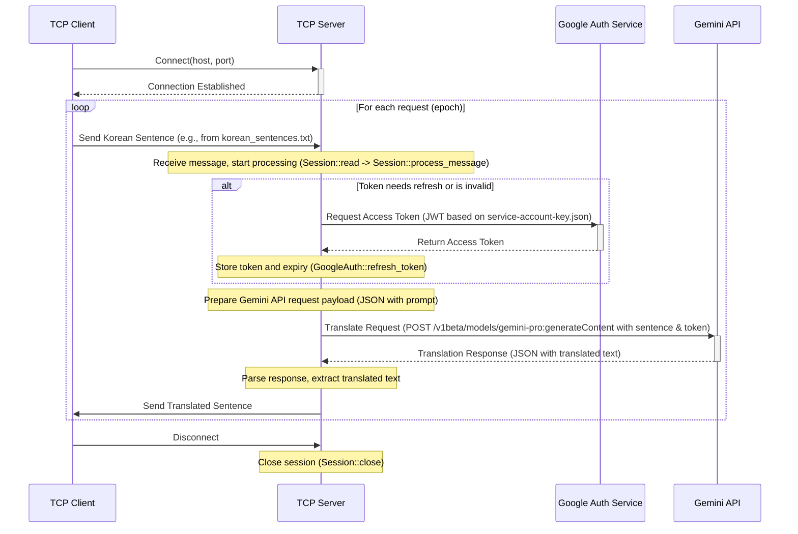

# Project Interaction Diagrams

## 1. Overall Interaction Flow

This diagram shows the complete sequence of interactions between the TCP Client, TCP Server, Google Authentication Service, and the Gemini API.



## 2. Measurement Flow (RTT & API Latency)

This diagram focuses specifically on how the client measures Round Trip Time (RTT) and how the server measures the latency of the Gemini API call.

```mermaid
sequenceDiagram
    participant C as TCP Client
    participant S as TCP Server
    participant GC as GeminiClient (in Server)
    participant GAPI as Gemini API

    %% Client RTT Measurement %%
    C->>C: Start RTT Timer (before asio::write in send_and_receive)
    C->>S: Send Message
    S->>GC: Process Message & Initiate API Request
    GC->>GC: Start API Latency Timer (in execute_request)
    GC->>GAPI: Send API Request
    GAPI-->>GC: API Response
    GC->>GC: Stop API Latency Timer (in poll_multi_handle)
    GC->>GC: Calculate & Record API Latency
    GC->>S: Return Translation
    S->>C: Send Response
    C->>C: Stop RTT Timer (after asio::read_until in send_and_receive)
    C->>C: Calculate & Record RTT (rtt_ms)